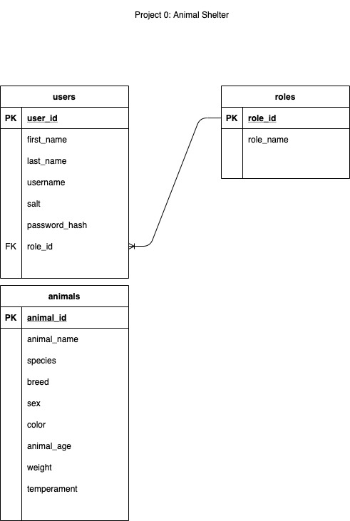

# Fur Haven Animal Shelter

Web Service / API to keep track of animals available for adoption in a (NO KILL!!) shelter.

## Features

<ul>
    <li>View animals (all, by ID, by species, by breed, by male/female)</li>
    <li>Manage animals (create, update, delete)</li>
    <li>View users (all, by ID, by username, by last name)</li>
    <li>Manage users (create, update, delete)</li>
    <li>Set roles for users (user, admin)</li>
    <li>User Login / Logout</li>
</ul>

## Technologies Utilized
<ul>
<li>Java Version 1.8</li>
<li>PostgreSQL Database 13</li>
<li>Apache Tomcat Server Version 9</li>
<li>Java Enterprise Javax Servlet API Version 3.1</li>
<li>Maven</li>
<li>JUnit4 (Testing)</li>
<li>Mockito (Testing)</li>
<li>Log4j Version 1.2 (Logging)</li>
<li>Jackson Databind Version 2.11 (JSON read / write)</li>
<li>Postman (User Interface / Testing)</li>
</ul>

## API Resources / URI's

Note: All results are returned in JSON format.
### Animals Domain
---
## View All Animals:
### `GET` http://animalshelter/animals/
Response: Returns all animals available for adoption.

## View Animals by Species, Breed, or Male/Female:
### `GET` http://animalshelter/animals?{species, breed, sex}={search value}/

Example: http://animalshelter/animals?species=cat/

Response: Returns all animals that match {search value}.

## View Animal by Id:
### `GET` http://animalshelter/animal/{id}/

Example: http://animalshelter/animal/1/

Response: Returns the animal matching the animal id {id}.

## Create New Animal:
### `POST` http://animalshelter/animal/

Action: Inserts new animal in database. Available for adoption!

Example of data needed in body of request:
```
    {
        "animalName": "Jacob3",
        "species": "dog",
        "breed": "Papillon",
        "sex": "male",
        "color": "white and brown",
        "animalAge": "2",
        "weight": "10",
        "temperament": "feisty"
    }
```
<ul>Constraints:
<li>Body of request must contain valid JSON.</li>
<li>All fields must be present in request.</li>
</ul>
Response: Returns the created animal if request was successful.

## Update Animal Based on Id:
### `PUT` http://animalshelter/animal/{id}/

Action: Update animal based on {id} and data in body of request.

Example of data needed in body of request:
```
    {
        "animalName": "Jacob6666",
        "species": "dog",
        "breed": "Papillon",
        "sex": "male",
        "color": "white and brown",
        "animalAge": "2",
        "weight": "10",
        "temperament": "feisty"
    }
```
<ul>Constraints:
<li>Body of request must contain valid JSON.</li>
<li>All fields must be present in request.</li>
</ul>
Response: Returns the revised animal if request was successful.

## Delete Animal Based on Id:
### `DELETE` http://animalshelter/animal/{id}/

Action: Deletes animal based on {id}.  Use when animal is adopted!!

Example: http://animalshelter/animal/1/

Response: Returns http status code `200 OK` if successful.

### Users Domain
---
## View All Users:
### `GET` http://animalshelter/users/
Response: Returns all users.

## Search For User by Userid, Username, or Lastname:
### `GET` http://animalshelter/users?{userid, username, or lastname}={search value}/

Example: http://animalshelter/users?username=acapp/

Response: Returns first user that matches {search value}.

## View User Based on Id:
### `GET` http://animalshelter/user/{id}/

Example: http://animalshelter/user/1/

Response: Returns the user matching the user id {id}.

## Create New User:
### `POST` http://animalshelter/user/

Action: Inserts new user in database.

Example of data needed in body of request:
```
    {
        "firstName": "Amber",
        "lastName": "Burns",
        "username": "amber3",
        "password": "1111",
        "role": "user"
    }
```
<ul>Constraints:
<li>Body of request must contain valid JSON.</li>
<li>All fields must be present.</li>
<li>Body must contain a unique username (no duplicate usernames allowed).</li>
<li>Body must contain a role. If not 'admin' (case insensitive) then will be assigned 'user' by default.</li> 
</ul>
Response: Returns the created user if request was successful.

## Update User Based on Id:
### `PUT` http://animalshelter/user/{id}/

Action: Update user based on {id} and data in body of request.

Example of data needed in body of request:
```
    {
        "firstName": "Amber2",
        "lastName": "Burns",
        "username": "amber3333",
        "password": "1111",
        "role": "Admin"
    }
```
<ul>Constraints:
<li>Body of request must contain valid JSON.</li>
<li>All fields except username must be present.</li>
<li>Username cannot be changed. This field will be ignored and can be omitted.</li>
<li>Body must contain a role. If not 'admin' (case insensitive) then will be assigned 'user' by default.</li> 
</ul>
Response: Returns the revised user if request was successful.

## Delete User Based on Id:
### `DELETE` http://animalshelter/user/{id}/

Action: Deletes user based on {id}.

Example: http://animalshelter/user/1/

<ul>Constraints:
<li>Must be logged in with 'Admin' role.</li>
</ul>
Response: Returns http status code `200 OK` if successful.

## Database Schema



## Installation

### User
<ol>
<li>Download Java Runtime Environment at: https://www.oracle.com/java/technologies/javase-jre8-downloads.html</li>
<li>Download PostgreSQL database at: https://www.postgresql.org/download/</li>
<li>Download Apache Tomcat version 9 at: https://tomcat.apache.org/download-90.cgi</li>
<li>Download animalshelter.war file from GitHub at: https://github.com/2011JavaReact/AndrewCappProject0AnimalShelter</li>
<li>Download Postman at: https://www.postman.com/downloads/</li>
<li>Start database session and create tables using scripts from GitHub:
<ul>
<li>Animal_Shelter_Scripts.sql</li>
<li>animals table.sql</li>
</ul>
</li>
<li>Update database url, username, and password environment variables with your database specific setup:
<ul>
<li>DB_URL</li>
<li>DB_USERNAME</li>
<li>DB_PASSWORD</li>
</ul>
</li>
<li>Copy animalshelter.war file to Tomcat application /webapps folder.</li>
<li>Start Tomcat server:
<ul>
<li>Windows: bin/startup.bat</li>
<li>Mac / Linux: bin/startup.sh</li>
</ul>
</li>
<li>Navigate to http://localhost:8080/animalshelter using Postman to begin using API.</li>
</ol>

### Developer
<ol>
<li>Download and install Java JDK, IDE, Postman, and Maven if needed.</li>
<li>Install PostreSQL and Tomcat as instructed above for users.</li>
<li>Update environment variables as instructed above for users plus:
<ul>
<li>JAVA_HOME - Jave source code location</li>
<li>CATALINA_HOME - Tomcat application location</li>
<li>MAVEN_HOME - Maven application location</li>
<li>M2_HOME - Maven application location (if needed)</li>
</ul>
</li>
<li>Connect to database and create tables as instructed above for users.</li>
<li>Download source code from GitHub at: https://github.com/2011JavaReact/AndrewCappProject0AnimalShelter.</li>
<li>Be sure to load dependencies from pom.xml file in project directory (Maven will install these automatically).</li>

## Contributing

Bug reports and pull requests are welcome on GitHub at https://github.com/2011JavaReact/AndrewCappProject0AnimalShelter. This project is intended to be a safe, welcoming space for collaboration, and contributors are expected to adhere to the [Contributor Covenant](http://contributor-covenant.org) code of conduct.

Written by **Andrew Capp** in conjunction with _Revature_ - November 2020.

## License

This API is available as open source under the terms of the [Apache License 2.0](https://github.com/2011JavaReact/AndrewCappProject0AnimalShelter/blob/main/LICENSE).

## Code of Conduct

Everyone interacting in the project’s codebases, issue trackers, chat rooms and mailing lists is expected to follow the [code of conduct](https://github.com/2011JavaReact/AndrewCappProject0AnimalShelter/blob/main/CODE_OF_CONDUCT.md).